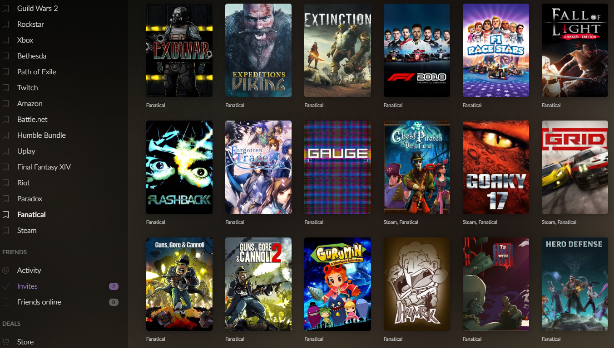
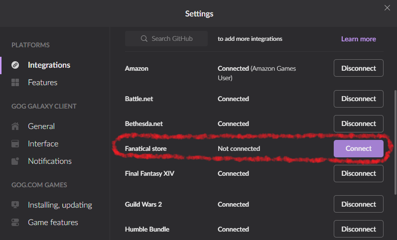
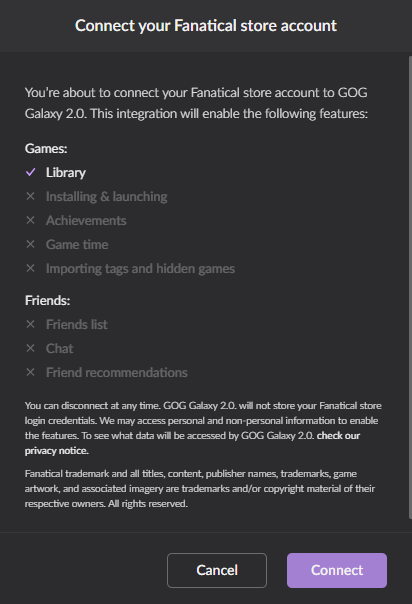
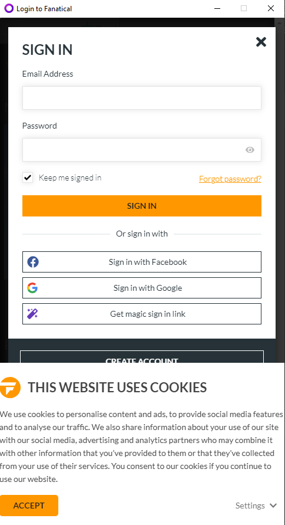
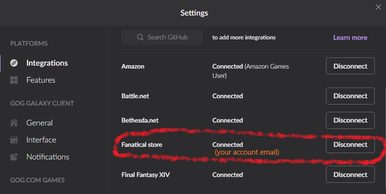
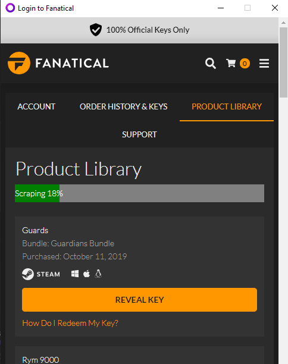

# GOG2_Fanatical_Plugin
GOG Galaxy 2.0 Connector to Fanatical Platform

## Overview
This plugin was written to let you see in the Gog Galaxy 2.0 UI all those owned-but-not-redeemed games that you purchased from Fanatical.

Note: this is an experimental project (no guarantee of any type) because, even if I'm quite experienced with different programming languages, this really it's my first phyton-based project.
So if you're a coder please do not look for the perfect phyton/js implementation in this, even if I did my best I'm not a phyton pro. 

But if your're a gamer or a collector that loves seeing all that game covers in the GOG2 grid then this plugin can be cool as it is for me :)

## Features

- See all your still non-redeemed keys in a Fanatical collection, as it happens with all the other platforms
- Refresh of owned games happens about every 15 minutes
- [Advanced*] You can map unusual fanatical used game names to recognized names in IGDB (used buy GOG), so to have  - finally - a gret cover image
- [Advanced*] You can manually exclude from the fanaticale owned games the ones you do not want to be considered by GOG (as for example DLC and so on), using also regex rules
- [Advanced*] The plugin works in two different modes: REST JSON mode (default and recommended) and a screen scraping mode (not recommended an still buggy)

\* See chapter "Advanced Configuration"

Due to the nature of Fanatical, this integration does not support tags, start, game time and other amenities, it just list owned unredeemed games.

# Installation 

Installation of a plugin is an easy procedure, consisting in the following steps
- Downloading the plugin
- Creating a sub-folder in a specific GOG-Galaxy folder
- Putting there the downloaded plugin
- Restarting Gog Galaxy

You can download the last tested and packaged release build or even use the last (untested and unpackaged) available code.

## 1. (recommended) Downloading the last release
You can find the last release zip [here](releases) (only windows 10 tested, but it may work also on other platforms).

## 1. (alternative) Downloading the last code available

Download all the src folder content [here](src) in a local directory.

## 2. Create plugin folder

You have to create a new folder where GOG Galaxy looks for plugins when starting.

- For Windows: %LOCALAPPDATA%\GOG.com\Galaxy\plugins\installed\\\<new-plugin-folder\>
- For MacOS: ${HOME}/Library/Application Support/GOG.com/Galaxy/plugins/installed/\<new-plugin-folder>

\<new-plugin-folder> may be simply the release zip name (recommended) or any other still non existing name you like.

Help for unexperienced windows users: %LOCALAPPDATA% is a folder located under the hidden AppData folder that is itself under your user folder. You can reach %LOCALAPPDATA% by one of this ways:
- browse with file explorer to \<installation-drive>\Users\\\<username>\AppData\Local
- within a cmd tool window type: **cd %LOCALAPPDATA%**
- in the search bar (just at the right of the window's start button) type: **%LOCALAPPDATA%**

## 3. Copy plugin in  just cerated folder
Unpack downloaded release zip to the just created folder (or copy all src contents if you downloaded code)

## 4. Restart GOG 2 Galaxy Client (and check if installation was successful)
You have to restart GOG Galaxy to let it see the new plugin. Please note that **closing the window will not exit GOG Galaxy, you have to use the exit menu** in the "gear" drop down (top left of the window)

After (really) exiting, re-start GoG Galaxy normally. When you get to the interface you still will not see anything changed, but the plugin should be installed, so let check for it going in to the same "gear" drop down menu and opening this time the Setting sub-menu

If a "Fanatical store" plugin is present in the integrations list, you have made it! Please note that the plugin status is disconnected (see next section to make your first connection).

# Accessing your Fanatical account library

To get all your unredeemed games, the plugin needs to have access to you account. 

If you're not already on the settings dialog, click the "gear" drop down menu and open it via the _Settings_ sub-menu. If the plugin is correctly installed you see a _Connect_ button corresponding the installed Fanatical plugin (see _check if installation was successful_ section). 

Click the _Connect_ button and another dialog pops-up giving you informations about the Fanatical Plugin's enabled capabilities (only Library will be enabled - see "Features" section for clarifications).

Click on the _Connect_ button on this last dialog and the GOG embedded browser will open right on the Fanatical home page. After some seconds the sing-in dialog will automatically pop-up, asking for your credentials.

Check the "Keep me singed in" flag, and then proceed normally through all the steps of authentication (also Google challenge and so on). If login is succesfull, ath the end you will get  to the standard successful login message, and after some seconds the browser window will close automatically.

You can verify if connection was successfull, checking the new status of the plugin.

Now GOG Galaxy will get a list of all your owned and unredeemed games, and in some time you will cet covers and a new "Fanatical" collection on the Interface.

Sometimes (expecially if you have many games, and if importing them is happaning at the same time also on other big libraries) it will take some minutes to import all your games and have their cover image ready. The plugin will check for updates every 15 minutes.

Normally after the first login authenticaton will be needed no more, because the Plugin will remember your credentials (as a normal browser would do), but you can always disconnect a re-connect with the same procedure if something strange happens (e.g. Fanatical plugin disconnects or gets a error when starting), or if you simply change credentials.

# Advanced Configuration

## Game name mapping and game exclusions

Sometines it is useful to map "unusual" Fanatical game names to more common ones, with the goal to get correct correspondance with cover and metadata taken by GOG Galaxy from the IGDB database.

You can force this type of mapping simply editing the **games_name_mapping.json** file located in the folder that contains the plugin.

The structure of such json file is the following:

>     {
>         "Azura": "Azura",
>         "GRID - 2019": "GRID (2019)",
>         "DLC": "__FORCE_EXCLUSION__",
>     }

Each couple of strings separated by a column will cause a tentative name substitution/exclusion.

The string at the left of the column will be matched with the "original" name of the game given by fanatical. If the given string is contained in the name (regular expressions can be used), then the name to the right of the column will subtituite the original one.

If the special value "\_\_FORCE_EXCLUSION\_\_" is used, the corresponding game matched will not be returned to GOG Galaxy. Current configuration excludes all games that have "DLC" in the fanatical name.

If you have more mapping to propose as default substitutions/exclusions please submit a pull request or raise an issue.

## Scraping Mode
If for some reason games can not be retrieved by Fanatical using direct queries, as it happens by default, you can try a second way to extract the unredeemed games, enabling "Scraping Mode".

Using this mode, authentication is equally necessary, but there is no need of all the security involved in direct queries after authentication: the plugin simply makes a copy of the game names that can be "seen" browsing through the library pages (this is called scraping in other contexts). The bad side of this featured mode is that it is higly dependant form details of the page, and it turns out to be not as reliable as the default mode in some cases. Anyway there could be some users that can benefit of this mode if the default one fails for some reason.

To enable "scraping mode" you have to change the **fanatical_configuratio.py** 

> SCRAPED_GAMES_MODE = True

Then GOG Galaxy has to be restarted.

During scraping of the library (done when authentication happens) a progress bar will appear indicating how much scraping work has to be done before finishing. 

Only after all the games have been scraped the embedded browser window will be closed.

Because of structural limitations, refresh time cannot be forced in Scraping Mode. Real re-scraping (and so updates) of the owned games happens only when the GOG Galaxy Application calls for a full refresh.

# Issue reporting
I wrote this plugin during my scarce free time (usally at night): no support is granted but you can try :)
Along with your detailed problem description, you may need to attach plugin log files located at:

Windows: %programdata%\GOG.com\Galaxy\logs

MacOS: /Users/Shared/GOG.com/Galaxy/Logs

The right log file simply contains "fanatical" :)
